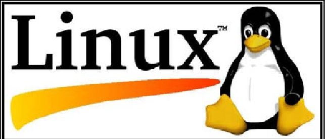

# Práctica: Instalación y configuración de un proyecto Angular con comandos Linux

## 1. Título  
**Proyecto Angular con Linux**

## 2. Tiempo de duración  
**150 minutos**

## 3. Fundamentos

En esta práctica se abordó el desarrollo de una aplicación Angular desde un entorno Linux, específicamente utilizando Ubuntu como sistema operativo base. Angular es un framework de desarrollo web creado por Google que permite construir aplicaciones dinámicas de una sola página (SPA - Single Page Application) utilizando TypeScript, HTML y CSS.

Para el desarrollo en Angular se requiere un entorno configurado con Node.js, npm (Node Package Manager), y Angular CLI (Command Line Interface). Linux ofrece un entorno versátil y muy poderoso para este tipo de desarrollos, ya que mediante comandos en la terminal es posible instalar, configurar y ejecutar herramientas sin necesidad de interfaces gráficas.

Durante la práctica se aprendió a:
- Utilizar comandos de Linux para moverse entre carpetas, crear directorios y editar archivos.
- Instalar Angular CLI mediante `npm`.
- Crear un nuevo proyecto Angular desde cero con el comando `ng new`.
- Ejecutar el servidor de desarrollo con `ng serve` para ver los cambios en tiempo real desde el navegador.
- Solucionar errores comunes como problemas con permisos (`sudo`), falta de `package.json`, o errores en la instalación de dependencias.

El uso de imágenes en esta parte del informe ayudará a comprender mejor la estructura de carpetas de un proyecto Angular, la interfaz de la terminal y el resultado final en el navegador.

> **Figura 1-1.** Logotipo de Angular.
 

> **Figura 1-2.** Logotipo de Linux.
 
 
## 4. Conocimientos previos

Para desarrollar correctamente esta práctica, se requiere que el estudiante tenga conocimiento de:

- Comandos básicos de Linux.
- Navegación de archivos desde terminal.
- Uso de navegadores web.
- Instalación de herramientas desde consola (npm, Angular CLI).
- Instalacion de paquetes de manera manual.


## 5. Objetivos a alcanzar

- Configurar un entorno de desarrollo web sobre Linux.
- Ejecutar y comprobar un servidor Angular desde terminal.
- Manipular archivos de configuración dentro de un proyecto Angular.


## 6. Equipo necesario

- Computador con sistema operativo Windows, Linux o macOS.
- Ubuntu instalado (en máquina real, virtual o WSL).
- Terminal Bash.
- Node.js v18 o superior.
- Angular CLI (última versión estable).
- Navegador actualizado (Chrome, Firefox, etc.).


## 7. Material de apoyo

- [Documentación de Angular](https://angular.io/)
- [Documentación de WSL](https://learn.microsoft.com/en-us/windows/wsl/)
- Guía de comandos básicos de Linux.
- Guía video colocado en la plataforma virtual del Instituto https://drive.google.com/file/d/1OitqZ02pX7VHaVx3qH9eF31mQent65rk/view

## 8. Procedimiento

**Paso 1:** Instalar WSL y Ubuntu dentro del terminal de PowerShell
```bash
wsl --install -d Ubuntu
```
> **Figura 8-1-1.** Instalación de Ubuntu.
 
 
> **Figura 8-1-2.** Instalación wsl.
 


**Paso 2:** Abrir Ubuntu e instalar Node.js y npm si no están instalados.  
```bash
sudo apt update
sudo apt install nodejs npm
```
> **Figura 8-2-1.** Instalacion de Node.js.
 
 
> **Figura 8-2-2.** Actualizaciones por ejecutarse.
 


**Paso 3:** Instalar Angular CLI.
```bash
npm install -g @angular/cli
```
> **Figura 8-3-1.** Instalar Angular CLI globalmente..
 
 
> **Figura 8-3-2.** Se cargan los recursos nesesarios.
 
 
> **Figura 8-3-3.** Obtenemos Angular CLI ultima versión.
 

 
**Paso 4:** Crear un nuevo proyecto Angular.
```bash
mkdir linux-franks
ng new "nombre-del-proyecto" en mi caso lo llame "y"
```
> **Figura 8-3-1.** Creamos carpeta de proyectos.
 
 
> **Figura 8-3-2.** Creamos un proyecto Angular dentro de ese directorio.
 
 
> **Figura 8-3-3.** Instalacion de recursos nesesarios del proyecto.
 


**Paso 5:** Iniciar el servidor de desarrollo.  
```bash
ng serve
```
> **Figura 8-5-1.** Instalacion de recursos nesesarios del proyecto.
 


**Paso 6:**  Abrir el navegador y acceder a http://localhost:4200 para ver la app funcionando. 

## 9. Resultados esperados


Al finalizar la práctica, se lograron los siguientes resultados:

- **Configuración exitosa del entorno de desarrollo** en Linux utilizando Ubuntu, demostrando que es posible trabajar con Angular desde la terminal sin necesidad de interfaces gráficas.

- **Instalación y configuración de Angular CLI** mediante `npm`, lo cual permitió crear y gestionar proyectos Angular fácilmente.

- **Creación de un nuevo proyecto Angular funcional**, con la estructura básica correctamente generada y sin errores en la instalación de dependencias.

- **Ejecución del servidor local de Angular**, confirmando que el proyecto podía ser servido correctamente en el navegador a través de `http://localhost:4200`.

- **Verificación visual del funcionamiento del proyecto**, mostrando la pantalla de bienvenida de Angular en el navegador.

- **Comprensión del flujo de trabajo básico en Angular**, desde la instalación hasta la visualización del proyecto, reforzando conocimientos sobre desarrollo frontend y uso de herramientas modernas.

- **Familiarización con la terminal de Linux**, permitiendo  ganar soltura en la ejecución de comandos, manejo de errores comunes (como `ENOENT` o permisos) y navegación de directorios.
  
> **Figura 9-1.** Resultado de practica.
 

  ## 🔊 Audio Explicativo del Proyecto Angular en WSL2
https://drive.google.com/file/d/1xNT2Qkx8xS4YYcOW_1rXk8FEmomSqs9i/view?usp=sharing

## 10. Bibliografía

- Angular Developers. (s.f.). *Angular Documentation*. Recuperado de [https://angular.io/docs](https://angular.io/docs)
- Microsoft. (s.f.). *Windows Subsystem for Linux Documentation*. Recuperado de [https://learn.microsoft.com/en-us/windows/wsl/](https://learn.microsoft.com/en-us/windows/wsl/)
